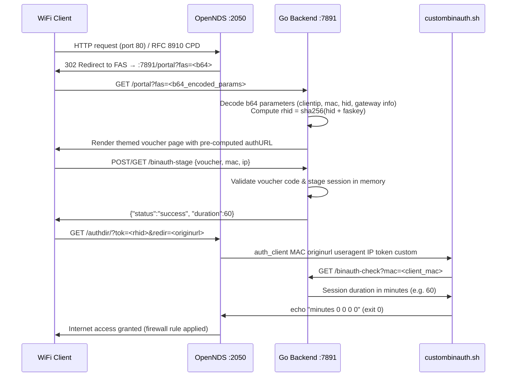

# RoseNet Access Portal

## OpenWrt WiFi Voucher System with OpenNDS

RoseNet Access Portal is a comprehensive, self-contained voucher authentication system designed for Wi-Fi users on OpenWrt routers. It provides a robust and lightweight solution for managing internet access through a captive portal, leveraging a Go backend, a vanilla JavaScript frontend, and modern integration with **OpenNDS** using FAS Level 1 (Forward Authentication Service).

> [!IMPORTANT]
> **OpenNDS requires OpenWrt 22.03 or newer** with **nftables/FW4**. If you are running legacy OpenWrt 21.02 or older (iptables/FW3), you must upgrade OpenWrt first.

---

## Table of Contents

- [Features](#features)
- [System Architecture](#system-architecture)
- [Authentication Flow](#authentication-flow)
- [Components](#components)
- [Installation & Deployment](#installation--deployment)
  - [Method 1: Using a Pre-compiled Release (Recommended)](#method-1-using-a-pre-compiled-release-recommended)
  - [Method 2: Building from Source](#method-2-building-from-source)
- [Usage](#usage)
  - [User Portal](#user-portal)
  - [Administrator Panel](#administrator-panel)
- [Configuration](#configuration)
  - [FAS Key Security](#fas-key-security)
  - [OpenNDS Configuration](#opennds-configuration)
- [API Endpoints](#api-endpoints)
- [Troubleshooting & Diagnostics](#troubleshooting--diagnostics)
- [Contributing](#contributing)
- [License](#license)

---

## Features

*   **Modern Captive Portal Integration**: Native OpenNDS v10+ support utilizing nftables (FW4) on modern OpenWrt releases.
*   **FAS Level 1 Security**: Forward Authentication Service with SHA256 hashed return tokens (`hid` / `rhid`), preventing URL-sniffing bypasses.
*   **Automatic Session Persistence (`auth_restore`)**: Client sessions survive router reboots seamlessly via OpenNDS's built-in client database.
*   **Lightweight & Efficient**: Optimized for resource-constrained OpenWrt environments without external C runtime dependencies.
*   **CGO-Free Go Backend**: Fast single-binary deployment with thread-safe JSON-based persistence.
*   **Multi-Themed User Experience**: Pre-configured responsive themes (Default, Modern, Corporate, and Retro-Music with bilingual support).
*   **Modern Administrator Dashboard**: Built with React 18 + Vite (SPA) for real-time voucher generation, sales metrics, active session monitoring, and theme management.
*   **Automatic Subnet & IP Detection**: Zero manual IP configuration — installer and backend automatically detect the router's LAN interface.

---

## System Architecture

The RoseNet Access Portal operates entirely on the OpenWrt router, comprising three core components:

1.  **OpenNDS Daemon (`opennds`)**: Intercepts unauthenticated HTTP port 80 traffic and captive portal detection (RFC 8910 / CPD) requests using nftables, redirecting clients to the FAS portal endpoint.
2.  **Go Backend (`voucher_server`)**: Runs as a local daemon on port `7891`, acting as the FAS authentication server, voucher validation engine, and admin API.
3.  **Frontend**:
    *   **User Portal**: Lightweight HTML5/CSS3/vanilla JS responsive voucher entry pages served dynamically by the Go backend.
    *   **Admin Dashboard (`/admin/`)**: Full-featured React 18 single-page application.
4.  **Custom BinAuth Script (`custombinauth.sh`)**: Installed at `/usr/lib/opennds/custombinauth.sh`, queried by OpenNDS to verify voucher session validity and retrieve granted duration in minutes.

---

## Authentication Flow



1.  **Captive Interception**: When a client connects to Wi-Fi and triggers captive portal detection, OpenNDS redirects the browser with an HTTP 302 to `http://<router-lan-ip>:7891/portal?fas=<base64_payload>`.
2.  **FAS Decode & Hash**: The Go backend decodes the Base64 payload, extracts `clientip`, `clientmac`, `hid`, `gatewayaddress`, `gatewayport`, and `authdir`. It computes the return hash:
    $$\text{rhid} = \text{SHA256}(\text{hid} + \text{faskey})$$
3.  **Portal Rendering**: The backend renders the selected theme template, safely injecting client parameters and the pre-computed OpenNDS authorization URL.
4.  **Voucher Submission**: The client submits a voucher code to `/binauth-stage`. The backend marks the voucher as used and stages the MAC and duration.
5.  **Authorization Handshake**: The browser redirects to the pre-computed OpenNDS auth URL (`http://<gw>:<port>/<authdir>/?tok=<rhid>`). OpenNDS validates the `rhid` and calls `/usr/lib/opennds/custombinauth.sh`.
6.  **BinAuth Check**: `custombinauth.sh` queries `/binauth-check?mac=<client_mac>` on the backend. The backend returns the duration in minutes, and `custombinauth.sh` outputs `"<minutes> 0 0 0 0"`.
7.  **Access Granted**: OpenNDS unblocks the client in nftables. On router reboots, OpenNDS automatically restores active sessions (`auth_restore`).

---

## Components

### Go Backend (`voucher_server`)

*   **Language**: Go (Golang)
*   **Database**: JSON-based thread-safe document store (`/data/voucher.json`, `/data/settings.json`)
*   **Log File**: `/tmp/voucher.log`
*   **Port**: `7891` (HTTP)
*   **FAS Key Storage**: `/opt/voucher/faskey` (read on startup or via `ROSENET_FASKEY` environment variable)

### Frontend

*   **User Voucher Pages**: Located in `frontend/themes/` (`default.html`, `modern.html`, `corporate.html`, `music.html`). Served dynamically with server-side template variable substitution (`{{BRAND}}`, `{{CLIENT_IP}}`, `{{CLIENT_MAC}}`, `{{AUTH_URL}}`).
*   **Administrator Panel**: Located in `frontend/admin/` (compiled from source in `frontend-admin/`). A modern React 18 + Vite dashboard with statistics, real-time voucher management, and theme selection.

### OpenNDS Integration

*   **Config File**: `/etc/config/opennds`
*   **BinAuth Script**: `/usr/lib/opennds/custombinauth.sh`
*   **Control CLI**: `ndsctl`

---

## Installation & Deployment

RoseNet Access Portal can be deployed on your OpenWrt router either using a pre-compiled binary release (recommended) or by building from source.

### Method 1: Using a Pre-compiled Release (Recommended)

1.  **SSH into your OpenWrt router**:

    ```sh
    ssh root@<router-lan-ip>
    ```

2.  **Check your router's architecture**:

    ```sh
    opkg print-architecture
    # or
    uname -m
    ```

    Map your architecture to the release package:

    | `uname -m` / arch | Release Archive |
    |---|---|
    | `aarch64` / `arm64` | `RoseNet-Portal-linux-arm64.zip` |
    | `armv7l`, `armv6l` / `arm` | `RoseNet-Portal-linux-arm.zip` |
    | `mips`, `mipsel` | `RoseNet-Portal-linux-mipsle.zip` |
    | `x86_64` / `amd64` | `RoseNet-Portal-linux-amd64.zip` |

3.  **Download the latest release**:

    ```sh
    wget https://github.com/nhAsif/RoseNet-Access-Portal/releases/latest/download/RoseNet-Portal-linux-arm64.zip
    ```

4.  **Extract the archive**:

    ```sh
    opkg update && opkg install unzip
    unzip RoseNet-Portal-linux-arm64.zip
    cd RoseNet-Portal-linux-arm64
    ```

5.  **Run the installation script**:

    ```sh
    chmod +x scripts/install.sh
    sh scripts/install.sh
    ```

    The `install.sh` script automates:
    *   Detects LAN IP automatically (from `network.lan.ipaddr` or `br-lan`).
    *   Removes legacy NoDogSplash configurations if previously installed.
    *   Installs OpenNDS via `opkg` if not already installed.
    *   Creates application directories (`/opt/voucher`, `/www/voucher`, `/data`).
    *   Generates a cryptographically secure FAS key and saves it to `/opt/voucher/faskey`.
    *   Writes `/etc/config/opennds` configured for FAS Level 1 pointing to the Go backend.
    *   Installs `/usr/lib/opennds/custombinauth.sh`.
    *   Configures and starts the `voucher` service (`/etc/init.d/voucher`) and `opennds`.

---

### Method 2: Building from Source

1.  **Build the Go binary**:

    On Linux/macOS:
    ```sh
    ./scripts/build.sh
    ```
    On Windows:
    ```cmd
    build.bat
    ```
    *(Adjust `GOARCH` in the script if building for an architecture other than `arm`/`arm64`.)*

2.  **Build the Admin Frontend**:

    ```sh
    cd frontend-admin
    npm install
    npm run build
    cd ..
    ```
    *The build emits static files directly into `frontend/admin/`.*

3.  **Copy files to the router**:

    ```sh
    scp -r RoseNet-Captive-Portal root@<router-lan-ip>:/root/
    ```

4.  **Run installer on the router**:

    ```sh
    ssh root@<router-lan-ip>
    cd /root/RoseNet-Captive-Portal
    chmod +x scripts/install.sh
    sh scripts/install.sh
    ```

---

## Usage

### User Portal

When users join the Wi-Fi network, their device's captive portal assistant or browser opens automatically and presents the voucher entry page. Entering a valid voucher grants internet access immediately.

Users with already active sessions reconnect without re-entering their voucher code.

### Administrator Panel

Access the dashboard at `http://<router-lan-ip>:7891/admin/`.

*   **Default Password**: `rosepinepink`
*   **Features**:
    *   Voucher management (generate single or bulk vouchers, set duration & price).
    *   Live sales & revenue analytics.
    *   Active sessions monitoring with MAC address and remaining time.
    *   Theme customizer (Default, Modern, Corporate, Music).
    *   Custom brand name and currency symbol settings.
    *   Password management.

---

## Configuration

### FAS Key Security

OpenNDS FAS Level 1 uses a shared secret (`faskey`) to hash the client tokens.
*   **Key file**: `/opt/voucher/faskey` (permissions `0600`)
*   **UCI option**: `option faskey` in `/etc/config/opennds`
*   **Environment override**: `ROSENET_FASKEY=<key>`

The installer creates a 32-byte random SHA256 key automatically. If reinstalling or upgrading, the existing key is preserved so that active client sessions remain valid.

### OpenNDS Configuration

Configuration is located at `/etc/config/opennds`. Key settings:

```uci
config opennds
  option enabled '1'
  option fwhook_enabled '1'
  option gatewayinterface 'br-lan'
  option gatewayname 'RoseNet'
  option maxclients '250'

  # FAS Level 1 Configuration
  option login_option_enabled '0'
  option fasport '7891'
  option faspath '/portal'
  option fasremoteip '<router-lan-ip>'
  option fas_secure_enabled '1'
  option faskey '<faskey>'

  # Session Timeouts
  option preauthidletimeout '30'
  option authidletimeout '120'
  option sessiontimeout '0'
  option checkinterval '15'

  # Pre-authenticated firewall rules
  list preauthenticated_users 'allow tcp port 7891'
  list preauthenticated_users 'allow udp port 7891'
  list authenticated_users 'allow all'
```

---

## API Endpoints

| Endpoint | Method | Access | Description |
|---|---|---|---|
| `/portal` | `GET` | Public | OpenNDS FAS landing page; decodes `fas` Base64 query parameter, computes `rhid`, and renders the themed voucher portal. |
| `/binauth-stage` | `POST`, `GET` | Public | Validates submitted voucher and stages client MAC and duration for OpenNDS authentication. |
| `/binauth-check` | `GET` | Internal | Queried by `custombinauth.sh` with `?mac=<mac>`; returns remaining session duration in **minutes**. |
| `/auth` | `GET` | Public | Direct client authorization trigger via `ndsctl`. |
| `/admin/login` | `POST` | Public | Administrator authentication endpoint. |
| `/admin/vouchers` | `GET` | Protected | Retrieves all vouchers with metadata and status. |
| `/admin/add` | `POST` | Protected | Generates new vouchers. |
| `/admin/delete` | `POST` | Protected | Revokes/deletes a voucher by code. |
| `/admin/settings` | `GET` | Protected | Retrieves system settings. |
| `/admin/update-settings` | `POST` | Protected | Updates brand name, active theme, currency, or password. |
| `/admin/stats` | `GET` | Protected | Returns dashboard metrics and revenue data. |

---

## Troubleshooting & Diagnostics

### OpenNDS CLI Diagnostics

```sh
# View OpenNDS status and connected clients
ndsctl status

# View all client sessions in JSON format
ndsctl json

# Inspect a specific client by MAC or IP
ndsctl json 192.168.1.150

# Increase debug logging level (0 to 3)
ndsctl debuglevel 3

# View OpenNDS system logs
logread | grep opennds

# View RoseNet backend logs
cat /tmp/voucher.log

# Manually authorize a client for testing (e.g. 60 minutes)
ndsctl auth <client_mac> 60 0 0 0 0
```

### Common Issues

| Symptom | Probable Cause | Resolution |
|---|---|---|
| **Client not redirected** | OpenNDS not running or wrong interface | Run `ndsctl status`. Verify `gatewayinterface 'br-lan'` in `/etc/config/opennds`. |
| **"Invalid FAS parameters" error** | URL parameters corrupted or wrong FAS level | Ensure `fas_secure_enabled '1'` is set in `/etc/config/opennds`. |
| **Voucher accepted but no internet access** | FAS key mismatch between backend and OpenNDS | Verify the key in `/opt/voucher/faskey` matches `option faskey` in `/etc/config/opennds`. Restart services. |
| **`custombinauth.sh` not executed** | File missing or lacking executable permissions | Run `chmod +x /usr/lib/opennds/custombinauth.sh`. |
| **Session duration too short / 1 minute** | Duration unit confusion | Verify Go backend `/binauth-check` returns minutes (default in v4+). |
| **Reboot loses sessions** | `option binauth` overridden in config | Ensure `option binauth` is **not** set in `/etc/config/opennds`; OpenNDS must run default `binauth_log.sh` for `auth_restore`. |

---

## Contributing

Contributions, bug reports, and suggestions are welcome! Please open an issue or pull request on GitHub.

---

## License

This project is licensed under the [GNU General Public License v3](LICENSE).
