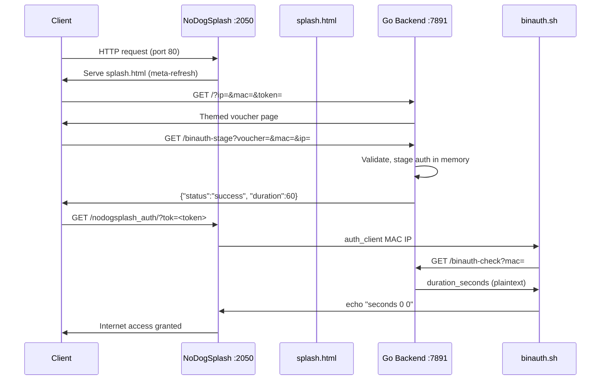

# Migration Plan: NoDogSplash → OpenNDS

## RoseNet Captive Portal Voucher System

> [!IMPORTANT]
> OpenNDS v10.x requires **OpenWrt 22.03+** with **nftables/FW4**. If you are running OpenWrt 21.02 or older (iptables/FW3), you must upgrade OpenWrt first.

---

## Table of Contents

1. [Why Migrate](#1-why-migrate)
2. [Architecture Comparison](#2-architecture-comparison)
3. [Key Differences Cheat Sheet](#3-key-differences-cheat-sheet)
4. [Migration Strategy](#4-migration-strategy)
5. [Phase 1 — Configuration Migration](#phase-1--configuration-migration)
6. [Phase 2 — BinAuth Script Rewrite](#phase-2--binauth-script-rewrite)
7. [Phase 3 — Backend (Go) Changes](#phase-3--backend-go-changes)
8. [Phase 4 — Frontend Theme Changes](#phase-4--frontend-theme-changes)
9. [Phase 5 — Installer Script Rewrite](#phase-5--installer-script-rewrite)
10. [Phase 6 — Splash Page Removal](#phase-6--splash-page-removal)
11. [Phase 7 — Testing & Validation](#phase-7--testing--validation)
12. [Phase 8 — Cleanup & Documentation](#phase-8--cleanup--documentation)
13. [Optional Enhancements](#optional-enhancements)
14. [Risk Assessment](#risk-assessment)
15. [File Change Summary](#file-change-summary)

---

## 1. Why Migrate

| Concern | NoDogSplash | OpenNDS |
|---|---|---|
| **Maintenance** | Abandoned / dormant | Actively maintained (v10.3.0+) |
| **Firewall** | iptables only | nftables (FW4), required on modern OpenWrt |
| **Captive Portal Standard** | Legacy port-80 redirect only | RFC 8910 (DHCP Option 114) + RFC 8908 (JSON API) |
| **Session Persistence** | None (volatile iptables; sessions lost on reboot) | Built-in `auth_restore` survives daemon restarts |
| **Traffic Shaping** | None built-in | Built-in rate limiting (kb/s) + volume quotas (kB) + FUP |
| **Walled Garden** | Manual IP-based rules | DNS-based FQDN walled garden (via `dnsmasq-full` + nftset) |
| **Security** | Plain token in URL | Hashed tokens (sha256), optional AES-256-CBC encryption |
| **OpenWrt 23.05+** | Broken (no iptables) | Fully supported |

---

## 2. Architecture Comparison

### Current Flow (NoDogSplash)



### Target Flow (OpenNDS — FAS Level 1 on localhost)

```mermaid
sequenceDiagram
    participant Client
    participant ONDS as OpenNDS :2050
    participant Backend as Go Backend :7891
    participant CBinAuth as custombinauth.sh

    Client->>ONDS: HTTP request (port 80) / RFC 8910 CPD
    ONDS->>Client: 302 Redirect to FAS → Backend :7891/portal?fas=<b64>
    Client->>Backend: GET /portal?fas=<b64_encoded_params>
    Backend->>Backend: Decode b64 → extract clientip, clientmac, gatewayname, hid, authdir, originurl
    Backend->>Client: Themed voucher page (no token in URL; uses hid)
    Client->>Backend: POST /binauth-stage {voucher, mac, ip}
    Backend->>Backend: Validate voucher, stage auth, compute rhid=sha256(hid+faskey)
    Backend->>Client: {"status":"success", "duration":60, "auth_url":"http://gw:2050/authdir/?tok=<rhid>&redir=..."}
    Client->>ONDS: GET /authdir/?tok=<rhid>&redir=<url>
    ONDS->>CBinAuth: auth_client MAC redir useragent IP token custom
    CBinAuth->>Backend: GET /binauth-check?mac=
    Backend->>CBinAuth: duration_minutes (plaintext)
    CBinAuth->>ONDS: echo "minutes upload_rate download_rate upload_quota download_quota"
    ONDS->>Client: Internet access granted
```

> [!NOTE]
> The biggest architectural change is that OpenNDS **does not use static `splash.html`** files. Instead, it redirects to your backend using the **FAS (Forward Authentication Service)** mechanism. Your Go backend becomes the FAS server.

---

## 3. Key Differences Cheat Sheet

| Aspect | NoDogSplash | OpenNDS |
|---|---|---|
| **Package** | `nodogsplash` | `opennds` |
| **Config file** | `/etc/config/nodogsplash` | `/etc/config/opennds` |
| **Config section** | `config nodogsplash` | `config opennds` |
| **Daemon** | `nodogsplash` | `opennds` |
| **CLI** | `ndsctl` | `ndsctl` (same name, extended commands) |
| **Init script** | `/etc/init.d/nodogsplash` | `/etc/init.d/opennds` |
| **Splash page** | Static `splash.html` with `$tok`, `$clientip`, `$clientmac` variables | **Removed**. Use FAS redirect or ThemeSpec |
| **Auth URL** | `http://gw:2050/nodogsplash_auth/?tok=<token>` | `http://gw:2050/<authdir>/?tok=<rhid>&redir=<url>` |
| **BinAuth args** | `$1=method $2=MAC $3=IP $4=user $5=pass` | `$1=method $2=MAC $3=originurl $4=useragent $5=IP $6=token $7=custom` |
| **BinAuth output** | `echo "seconds upload_kbps download_kbps"` (3 values) | `echo "minutes upload_rate download_rate upload_quota download_quota"` (5 values) |
| **Duration unit** | **Seconds** | **Minutes** |
| **Custom BinAuth** | Override `option binauth` directly | Use `/usr/lib/opennds/custombinauth.sh` (do NOT override `binauth`) |
| **Session restore** | Manual (our `reauthSessionsViaNDS()` goroutine) | Built-in `auth_restore` via `binauth_log.sh` |
| **ndsctl auth** | `ndsctl auth <mac> <seconds>` | `ndsctl auth <mac\|ip> [timeout] [uprate] [downrate] [upquota] [downquota] [custom]` |
| **Token security** | Plain token passed in URL | `hid = sha256(token + faskey)`, `rhid = sha256(hid + faskey)` |

---

## 4. Migration Strategy

We'll use **FAS Level 1 (Hashed ID, HTTP, localhost)** — the ideal approach because:
- Our Go backend runs on the **same router** (localhost), so HTTPS is unnecessary
- Level 1 keeps the token secret (hashed), preventing URL-sniffing bypass
- No PHP or encryption dependencies needed on the router
- Minimal changes to existing architecture — backend becomes the FAS server

**Overall approach**: Incremental, phase-by-phase. Each phase is independently testable.

---

## Phase 1 — Configuration Migration

### 1.1 Create new OpenNDS UCI config

Replace the NoDogSplash config with an OpenNDS config.

**Old file**: `nodogsplash/nodogsplash.conf`
**New file**: `opennds/opennds.conf`

```
config opennds
  option enabled '1'
  option fwhook_enabled '1'
  option debuglevel '1'

  # Network interface
  option gatewayinterface 'br-lan'
  option gatewayname 'RoseNet'
  option maxclients '250'

  # Portal mode: FAS (Forward Authentication Service)
  option login_option_enabled '0'

  # FAS Configuration — points to our local Go backend
  option fasport '7891'
  option faspath '/portal'
  option fasremoteip '127.0.0.1'
  option fas_secure_enabled '1'

  # The faskey is used for hid/rhid token hashing.
  # Generate a unique key for your deployment:
  #   head -c 32 /dev/urandom | sha256sum | cut -d' ' -f1
  option faskey 'CHANGE_ME_TO_A_RANDOM_SHA256_HASH'

  # Timeouts
  option preauthidletimeout '30'
  option authidletimeout '120'
  option sessiontimeout '0'
  option checkinterval '15'

  # BinAuth — IMPORTANT: Do NOT change this path.
  # binauth_log.sh handles auth_restore (session persistence across reboots).
  # Custom logic goes in custombinauth.sh (see Phase 2).
  # option binauth '/usr/lib/opennds/binauth_log.sh'

  # Allow clients to reach our Go backend BEFORE authentication
  list preauthenticated_users 'allow tcp port 7891'
  list preauthenticated_users 'allow udp port 7891'

  # Allow authenticated users full internet access
  list authenticated_users 'allow all'

  # Allow clients to reach essential router services
  list users_to_router 'allow tcp port 22'
  list users_to_router 'allow tcp port 23'
  list users_to_router 'allow tcp port 53'
  list users_to_router 'allow udp port 53'
  list users_to_router 'allow udp port 67'
  list users_to_router 'allow tcp port 80'
  list users_to_router 'allow tcp port 7891'

  # Trusted MACs (bypass portal entirely)
  list trustedmac 'ac:e0:10:81:1c:11'
  list trustedmac 'b8:c3:85:7f:68:44'
  list trustedmac 'd0:9c:7a:d6:5a:b8'
```

### 1.2 Key config changes explained

| NoDogSplash option | OpenNDS equivalent | Notes |
|---|---|---|
| `option binauth '/opt/voucher/binauth.sh'` | Leave default (`binauth_log.sh`) + `custombinauth.sh` | OpenNDS's default binauth handles `auth_restore`. Custom logic goes in a separate file. |
| `option splashpage 'splash.html'` | **Removed** — replaced by FAS config | `login_option_enabled '0'` + `fasport`/`faspath`/`fasremoteip` |
| `option client_idle_timeout` | `option authidletimeout` | Same concept, slightly different naming |
| `option client_force_timeout` | `option sessiontimeout` | `0` = no forced timeout |
| (none) | `option fas_secure_enabled '1'` | Level 1 hashed token security |
| (none) | `option faskey '...'` | Pre-shared key for HMAC hashing |
| (none) | `option gatewayfqdn 'status.client'` | Optional: enables RFC 8910 status page |

### 1.3 Tasks

- [x] Create `opennds/opennds.conf` with the config above
- [x] Delete or archive `nodogsplash/nodogsplash.conf`
- [x] Rename directory `nodogsplash/` → `opennds/`

---

## Phase 2 — BinAuth Script Rewrite

### 2.1 Why custombinauth.sh instead of a standalone script

OpenNDS v10.1+ **always** runs `/usr/lib/opennds/binauth_log.sh` as the binauth handler. This script:
- Maintains the persistent client database used by `auth_restore` (session survival across reboots)
- Sources `/usr/lib/opennds/custombinauth.sh` if it exists, for custom authorization logic

This means **we get reboot session persistence for free** — no more need for our `reauthSessionsViaNDS()` goroutine!

### 2.2 New script: `scripts/custombinauth.sh`

```sh
#!/bin/sh

# OpenNDS Custom BinAuth Script for RoseNet Voucher System
# This file is installed to /usr/lib/opennds/custombinauth.sh
#
# Called by OpenNDS's binauth_log.sh on authentication events.
#
# For auth_client events, the following variables are available:
#   $1 = method (auth_client)
#   $2 = client MAC
#   $3 = originurl (URL-encoded)
#   $4 = useragent (URL-encoded)
#   $5 = client IP
#   $6 = client token/hid
#   $7 = custom data (URL-encoded, from FAS redirect)
#
# Expected output on auth_client (5 space-separated values):
#   <session_minutes> <upload_rate_kbps> <download_rate_kbps> <upload_quota_kB> <download_quota_kB>
# Exit 0 = allow, Exit 1 = deny

if [ "$1" != "auth_client" ]; then
  # For non-auth events (client_auth, deauth, etc.), allow default processing.
  exit 0
fi

CLIENT_MAC="$2"

if [ -z "$CLIENT_MAC" ]; then
  exit 1
fi

# Ask the Go backend for the duration (in minutes) associated with this MAC.
# The backend stages this when the user submits a voucher code.
DURATION_MINUTES=$(curl -s -f "http://127.0.0.1:7891/binauth-check?mac=${CLIENT_MAC}")

if [ $? -eq 0 ] && [ -n "$DURATION_MINUTES" ]; then
  # Success: Output 5 values for OpenNDS
  # Format: <session_minutes> <upload_rate_kbps> <download_rate_kbps> <upload_quota_kB> <download_quota_kB>
  # 0 = unlimited for rates/quotas
  echo "$DURATION_MINUTES 0 0 0 0"
  exit 0
else
  exit 1
fi
```

### 2.3 Critical unit change: seconds → minutes

| | NoDogSplash | OpenNDS |
|---|---|---|
| BinAuth duration | **Seconds** | **Minutes** |
| `ndsctl auth` timeout | Seconds | Minutes |

The Go backend's `/binauth-check` endpoint currently returns **seconds**. It must be changed to return **minutes** for OpenNDS.

### 2.4 Tasks

- [x] Create `scripts/custombinauth.sh` with the script above
- [x] Archive or delete `scripts/binauth.sh`
- [x] Update backend `/binauth-check` to return **minutes** instead of seconds (see Phase 3)

---

## Phase 3 — Backend (Go) Changes

This is the most significant phase. Changes to `backend/main.go`:

### 3.1 New endpoint: `/portal` (FAS landing page)

OpenNDS will redirect captured clients to:
```
http://127.0.0.1:7891/portal?fas=<base64_encoded_params>&username=<optional>
```

The `fas` query parameter is a Base64-encoded string containing:
```
clientip=<ip>, clientmac=<mac>, gatewayname=<name>, hid=<sha256_hash>,
gatewayaddress=<gw_ip>, gatewayport=<port>, authdir=<dir>, originurl=<url>,
clientif=<interface>, ...custom_params
```

**New handler `portalHandler`**:

```go
import (
    "crypto/sha256"
    "encoding/base64"
    // ... existing imports
)

// fasKey must match the 'faskey' in /etc/config/opennds.
// In production, read this from settings or an environment variable.
var fasKey = "CHANGE_ME_TO_A_RANDOM_SHA256_HASH"

func portalHandler(w http.ResponseWriter, r *http.Request) {
    fasB64 := r.URL.Query().Get("fas")
    if fasB64 == "" {
        // Not a FAS redirect — serve the root page as fallback
        rootHandler(w, r)
        return
    }

    // Decode the Base64 FAS payload
    decoded, err := base64.StdEncoding.DecodeString(fasB64)
    if err != nil {
        // Try URL-safe base64
        decoded, err = base64.URLEncoding.DecodeString(fasB64)
        if err != nil {
            http.Error(w, "Invalid FAS parameters", http.StatusBadRequest)
            return
        }
    }

    // Parse comma-separated key=value pairs
    params := parseFASParams(string(decoded))

    clientIP := params["clientip"]
    clientMAC := params["clientmac"]
    hid := params["hid"]
    gatewayAddress := params["gatewayaddress"]
    gatewayPort := params["gatewayport"]
    authDir := params["authdir"]
    originURL := params["originurl"]

    if clientMAC == "" || hid == "" {
        http.Error(w, "Missing client parameters", http.StatusBadRequest)
        return
    }

    // Compute the return hash: rhid = sha256(hid + faskey)
    rhid := computeRHID(hid, fasKey)

    // Build the auth URL that the frontend will redirect to after voucher validation
    authURL := fmt.Sprintf("http://%s:%s/%s/?tok=%s&redir=%s",
        gatewayAddress, gatewayPort, authDir, rhid, originURL)

    // Serve the themed portal page, injecting client info as JS variables
    servePortalPage(w, clientIP, clientMAC, authURL)
}

// parseFASParams parses the OpenNDS FAS decoded string.
// Format: "clientip=1.2.3.4, clientmac=aa:bb:cc:dd:ee:ff, ..."
func parseFASParams(decoded string) map[string]string {
    params := make(map[string]string)
    for _, pair := range strings.Split(decoded, ", ") {
        parts := strings.SplitN(pair, "=", 2)
        if len(parts) == 2 {
            params[strings.TrimSpace(parts[0])] = strings.TrimSpace(parts[1])
        }
    }
    return params
}

// computeRHID computes the return hash ID: sha256(hid + faskey)
func computeRHID(hid, key string) string {
    h := sha256.New()
    h.Write([]byte(hid + key))
    return fmt.Sprintf("%x", h.Sum(nil))
}

func servePortalPage(w http.ResponseWriter, clientIP, clientMAC, authURL string) {
    theme, err := getSetting("active_theme")
    if err != nil || theme == "" {
        theme = "default"
    }

    themePath := fmt.Sprintf("%s/themes/%s.html", frontendDir, theme)
    if _, err := os.Stat(themePath); os.IsNotExist(err) {
        themePath = fmt.Sprintf("%s/themes/default.html", frontendDir)
    }

    content, err := os.ReadFile(themePath)
    if err != nil {
        http.Error(w, "Portal unavailable", http.StatusInternalServerError)
        return
    }

    brand, _ := getSetting("brand_name")
    if brand == "" {
        brand = "RoseNet"
    }

    page := strings.ReplaceAll(string(content), "{{BRAND}}", html.EscapeString(brand))
    page = strings.ReplaceAll(page, "{{CLIENT_IP}}", html.EscapeString(clientIP))
    page = strings.ReplaceAll(page, "{{CLIENT_MAC}}", html.EscapeString(clientMAC))
    page = strings.ReplaceAll(page, "{{AUTH_URL}}", html.EscapeString(authURL))

    w.Header().Set("Content-Type", "text/html; charset=utf-8")
    w.Write([]byte(page))
}
```

### 3.2 Update `/binauth-check` — return minutes instead of seconds

```go
func binauthCheckHandler(w http.ResponseWriter, r *http.Request) {
    clientMAC := r.URL.Query().Get("mac")
    if clientMAC == "" {
        http.Error(w, "MAC address required", http.StatusBadRequest)
        return
    }

    stagedAuthsMutex.Lock()
    durationSeconds, ok := stagedAuths[clientMAC]
    if ok {
        delete(stagedAuths, clientMAC)
    }
    stagedAuthsMutex.Unlock()

    if ok {
        // Convert seconds to minutes for OpenNDS (round up to avoid 0)
        durationMinutes := (durationSeconds + 59) / 60
        w.Header().Set("Content-Type", "text/plain")
        fmt.Fprintf(w, "%d", durationMinutes)
        return
    }

    // Fallback: check for existing active session
    vouchers, err := getVouchers()
    if err == nil {
        now := time.Now()
        for _, v := range vouchers {
            if v.UserMAC == clientMAC && v.IsUsed && v.Duration > 0 && !v.StartTime.IsZero() {
                expiry := v.StartTime.Add(time.Duration(v.Duration) * time.Minute)
                if now.Before(expiry) {
                    remainingMinutes := int(expiry.Sub(now).Minutes())
                    if remainingMinutes < 1 {
                        remainingMinutes = 1
                    }
                    w.Header().Set("Content-Type", "text/plain")
                    fmt.Fprintf(w, "%d", remainingMinutes)
                    return
                }
            }
        }
    }
    http.Error(w, "Not authorized", http.StatusUnauthorized)
}
```

### 3.3 Update `/binauth-stage` response — include auth_url

The frontend needs the computed auth URL. Modify `binauthStageHandler` to optionally accept and return auth information:

```go
func binauthStageHandler(w http.ResponseWriter, r *http.Request) {
    // ... existing validation logic stays the same ...

    // Return the auth URL if it was passed (OpenNDS mode)
    response := map[string]interface{}{
        "status":   "success",
        "duration": voucher.Duration,
    }
    json.NewEncoder(w).Encode(response)
}
```

> [!TIP]
> The auth URL is now injected server-side into the HTML template via `{{AUTH_URL}}` instead of being constructed client-side from URL parameters. This is more secure — the token hash never appears in JavaScript source.

### 3.4 Update route registration in `main()`

```go
func main() {
    // ... existing setup ...

    // OpenNDS FAS portal endpoint (replaces splash.html redirect)
    http.HandleFunc("/portal", portalHandler)

    // Keep existing endpoints for backward compatibility during migration
    http.HandleFunc("/binauth-stage", binauthStageHandler)
    http.HandleFunc("/binauth-check", binauthCheckHandler)
    http.HandleFunc("/auth", authHandler)

    // ... admin routes stay the same ...
    http.HandleFunc("/", rootHandler)

    // ... rest stays the same ...
}
```

### 3.5 Remove `reauthSessionsViaNDS()` goroutine

OpenNDS's built-in `binauth_log.sh` + `auth_restore` handles session persistence across reboots automatically. Our custom reboot recovery logic is no longer needed.

**Delete or comment out**:
- `reauthSessionsViaNDS()` function (lines 589–639)
- The `go reauthSessionsViaNDS()` call in `main()` (line 90)
- `restageActiveUsers()` function (lines 562–575) — no longer needed as a boot-time workaround
- The `restageActiveUsers()` call in `main()` (line 85)
- `activeSession` struct and `getActiveSessions()` function (lines 536–560)

> [!WARNING]
> Only remove these after confirming `auth_restore` works correctly in testing. Keep them commented out initially.

### 3.6 Update `ndsctl` command format

If you keep any `ndsctl` calls (e.g., for a future manual deauth feature), note that `ndsctl auth` now takes **minutes** not seconds:

```go
// Old (NoDogSplash): ndsctl auth <mac> <seconds>
exec.Command("ndsctl", "auth", mac, strconv.Itoa(remainingSeconds))

// New (OpenNDS): ndsctl auth <mac> <minutes> [uprate] [downrate] [upquota] [downquota]
exec.Command("ndsctl", "auth", mac, strconv.Itoa(remainingMinutes))
```

### 3.7 FAS key management

Add `faskey` to the settings system so it can be configured without recompiling:

```go
func init() {
    // ... existing init ...

    // Read faskey from environment or settings
    if key := os.Getenv("ROSENET_FASKEY"); key != "" {
        fasKey = key
    }
}
```

### 3.8 Summary of backend changes

| File | Change | Impact |
|---|---|---|
| `main.go` | Add `portalHandler` + FAS parsing + RHID computation | **New endpoint** — FAS entry point |
| `main.go` | Update `binauthCheckHandler` to return minutes | **Breaking** for NoDogSplash |
| `main.go` | Add `/portal` route | New route registration |
| `main.go` | Remove `reauthSessionsViaNDS()` and related code | Cleanup ~100 lines |
| `main.go` | Add `crypto/sha256`, `encoding/base64` imports | New imports |
| `main.go` | Add `fasKey` variable and `computeRHID()`, `parseFASParams()` | New FAS security functions |

---

## Phase 4 — Frontend Theme Changes

Every theme file in `frontend/themes/` needs updates to the JavaScript authentication flow.

### 4.1 What changes in each theme

**Remove** (NoDogSplash-specific):
- URL parameter parsing for `ip`, `mac`, `token` from query string
- Client-side construction of `http://hostname:2050/nodogsplash_auth/?tok=${token}`
- The `?tok=` redirect URL

**Replace with** (OpenNDS FAS):
- Server-injected template variables: `{{CLIENT_IP}}`, `{{CLIENT_MAC}}`, `{{AUTH_URL}}`
- The auth URL is pre-computed server-side with the correct `rhid`

### 4.2 Updated JavaScript block (for each theme)

Replace the current `<script>` block's auth logic with:

```html
<script>
    // Client info injected server-side by Go backend via FAS
    const clientIP = '{{CLIENT_IP}}';
    const clientMAC = '{{CLIENT_MAC}}';
    const authURL = '{{AUTH_URL}}';

    document.getElementById('voucher-form').addEventListener('submit', async function(e) {
      e.preventDefault();
      const voucherCode = document.getElementById('voucher-input').value.trim();
      if (!voucherCode) return;

      const errorMessage = document.getElementById('error-message');
      const successMessage = document.getElementById('success-message');
      const btn = document.getElementById('submit-btn');

      errorMessage.textContent = '';
      successMessage.textContent = '';
      btn.disabled = true;
      btn.textContent = 'Connecting...';

      if (!clientIP || !clientMAC || !authURL) {
        errorMessage.textContent = 'Required information is missing. Please reconnect to WiFi.';
        btn.disabled = false;
        btn.textContent = 'Connect';
        return;
      }

      try {
        const response = await fetch(`/binauth-stage?voucher=${voucherCode}&ip=${clientIP}&mac=${clientMAC}`);
        const data = await response.json();
        if (!response.ok) throw new Error(data.error || 'Unknown error');

        successMessage.textContent = `Success! Access for ${data.duration} minutes. Redirecting...`;
        btn.textContent = 'Connected';

        // Redirect to OpenNDS auth endpoint (pre-computed with rhid)
        setTimeout(() => {
          window.location.href = authURL;
        }, 1200);
      } catch (error) {
        errorMessage.textContent = `Error: ${error.message}`;
        btn.disabled = false;
        btn.textContent = 'Connect';
      }
    });

    // Auto-check for existing sessions (re-auth without voucher entry)
    (async function() {
      if (clientMAC && authURL) {
        try {
          const resp = await fetch(`/binauth-check?mac=${clientMAC}`);
          if (resp.ok) {
            // Already has active session — redirect straight through
            window.location.href = authURL;
          }
        } catch (e) {}
      }
    })();
</script>
```

### 4.3 Files to update

- [x] `frontend/themes/default.html` — Update JS auth block
- [x] `frontend/themes/modern.html` — Update JS auth block
- [x] `frontend/themes/corporate.html` — Update JS auth block
- [x] `frontend/themes/music.html` — Update JS auth block (also has Bangla text)
- [x] `frontend/index.html` — Update fallback page if it has NDS references

### 4.4 What stays the same

- All CSS/styling — **no changes**
- HTML structure — **no changes**
- The `{{BRAND}}` template variable — **still works**
- Audio/media assets — **no changes**
- The admin dashboard (`frontend-admin/`) — **no changes** (talks to backend API, not NDS)

---

## Phase 5 — Installer Script Rewrite

### 5.1 Changes to `scripts/install.sh`

The installer needs a complete overhaul of the NoDogSplash sections:

```sh
#!/bin/sh

SCRIPT_DIR="$(cd "$(dirname "$0")" && pwd)"
RELEASE_ROOT="$(dirname "$SCRIPT_DIR")"

echo "Setting up RoseNet Voucher System with OpenNDS..."

# 0. Detect LAN IP
echo "Detecting LAN IP address..."
if [ -z "$LAN_IP" ]; then
    LAN_IP="$(uci -q get network.lan.ipaddr)"
fi
if [ -z "$LAN_IP" ]; then
    LAN_IP="$(ip -4 addr show br-lan 2>/dev/null | grep -oE 'inet [0-9.]+' | awk '{print $2}' | head -n1)"
fi
LAN_IP="${LAN_IP%%/*}"
if [ -z "$LAN_IP" ]; then
    echo "Error: could not detect LAN IP address."
    echo "Set it manually with: LAN_IP=<router-ip> ./scripts/install.sh"
    exit 1
fi
echo "Using LAN IP: $LAN_IP"

# 1. Create directories
echo "Creating directories..."
mkdir -p /www/voucher
mkdir -p /opt/voucher
mkdir -p /data

# 2. Copy application files
echo "Copying application files..."
cp "$RELEASE_ROOT/voucher_server" /opt/voucher/
chmod +x /opt/voucher/voucher_server
cp -r "$RELEASE_ROOT/frontend"/* /www/voucher/

# 3. Create procd init script (unchanged from original)
echo "Creating init.d startup script..."
cat << 'EOF' > /etc/init.d/voucher
#!/bin/sh /etc/rc.common
START=99
STOP=10
USE_PROCD=1
PROG=/opt/voucher/voucher_server

start_service() {
    procd_open_instance
    procd_set_param command $PROG
    procd_set_param stdout 1
    procd_set_param stderr 1
    procd_set_param user root
    procd_set_param respawn
    procd_close_instance
}
stop_service() {
    echo "Stopping voucher server..."
}
reload_service() {
    stop
    start
}
EOF
chmod +x /etc/init.d/voucher
/etc/init.d/voucher enable
/etc/init.d/voucher restart

# 4. Remove NoDogSplash if present
if [ -f /etc/init.d/nodogsplash ]; then
    echo "Removing NoDogSplash..."
    /etc/init.d/nodogsplash stop 2>/dev/null
    /etc/init.d/nodogsplash disable 2>/dev/null
    opkg remove nodogsplash 2>/dev/null
    rm -f /etc/config/nodogsplash
    rm -rf /etc/nodogsplash
    echo "NoDogSplash removed."
fi

# 5. Install and configure OpenNDS
echo "Setting up OpenNDS..."
if [ ! -f /etc/init.d/opennds ]; then
    echo "OpenNDS not found. Installing via opkg..."
    opkg update
    if ! opkg install opennds; then
        echo "Error: failed to install OpenNDS via opkg."
        echo "Check your internet connection and opkg feeds."
        exit 1
    fi
fi

# Generate a unique FAS key for this installation
FASKEY=$(head -c 32 /dev/urandom | sha256sum | cut -d' ' -f1)
echo "Generated FAS key: $FASKEY"
echo "IMPORTANT: Save this key. It must match your backend configuration."

# Backup existing OpenNDS config if present
if [ -f /etc/config/opennds ]; then
    cp /etc/config/opennds /etc/config/opennds.bak
fi

# Write OpenNDS configuration
echo "Creating OpenNDS configuration..."
cat << EOF > /etc/config/opennds
config opennds
  option enabled '1'
  option fwhook_enabled '1'
  option debuglevel '1'
  option gatewayinterface 'br-lan'
  option gatewayname 'RoseNet'
  option maxclients '250'

  # FAS mode — redirect to local Go backend
  option login_option_enabled '0'
  option fasport '7891'
  option faspath '/portal'
  option fasremoteip '${LAN_IP}'
  option fas_secure_enabled '1'
  option faskey '${FASKEY}'

  # Timeouts
  option preauthidletimeout '30'
  option authidletimeout '120'
  option sessiontimeout '0'
  option checkinterval '15'

  # Firewall rules
  list preauthenticated_users 'allow tcp port 7891'
  list preauthenticated_users 'allow udp port 7891'
  list authenticated_users 'allow all'
  list users_to_router 'allow tcp port 22'
  list users_to_router 'allow tcp port 23'
  list users_to_router 'allow tcp port 53'
  list users_to_router 'allow udp port 53'
  list users_to_router 'allow udp port 67'
  list users_to_router 'allow tcp port 80'
  list users_to_router 'allow tcp port 7891'
EOF

# 6. Install custom binauth script
echo "Installing custom BinAuth script..."
cp "$SCRIPT_DIR/custombinauth.sh" /usr/lib/opennds/custombinauth.sh
chmod +x /usr/lib/opennds/custombinauth.sh

# 7. Write the faskey to a file so the Go backend can read it
echo "$FASKEY" > /opt/voucher/faskey
chmod 600 /opt/voucher/faskey

# 8. Restart OpenNDS
echo "Starting OpenNDS..."
/etc/init.d/opennds restart

echo ""
echo "========================================"
echo " Installation complete!"
echo "========================================"
echo " Admin panel: http://${LAN_IP}:7891/admin/"
echo " FAS key:     ${FASKEY}"
echo "========================================"
```

### 5.2 Key differences from old installer

| Old (NoDogSplash) | New (OpenNDS) |
|---|---|
| `opkg install nodogsplash` | `opkg install opennds` |
| Creates `splash.html` in `/etc/nodogsplash/htdocs/` | **No splash.html** — FAS handles redirect |
| Writes `/etc/config/nodogsplash` | Writes `/etc/config/opennds` |
| Copies `binauth.sh` to `/opt/voucher/` | Copies `custombinauth.sh` to `/usr/lib/opennds/` |
| `option binauth '/opt/voucher/binauth.sh'` | Default binauth stays; custom logic in `custombinauth.sh` |
| No FAS key | Generates unique `faskey` per installation |
| `/etc/init.d/nodogsplash restart` | `/etc/init.d/opennds restart` |

---

## Phase 6 — Splash Page Removal

OpenNDS does not use static `splash.html` pages. The entire splash mechanism is replaced by the FAS redirect.

### 6.1 Files to delete

- [x] Remove the `splash.html` generation from `install.sh` (already done in Phase 5)
- [x] Remove `mkdir -p /etc/nodogsplash/htdocs/` from installer

### 6.2 How OpenNDS replaces splash.html

```
NoDogSplash:
  Client → port 80 → NDS serves splash.html → meta-refresh to :7891/?ip=&mac=&token=

OpenNDS:
  Client → port 80 → nftables redirect to :2050 → OpenNDS 302 to :7891/portal?fas=<b64>
```

The client parameters (IP, MAC, gateway info, hashed token) are all packed into the Base64-encoded `fas` parameter by OpenNDS automatically. No intermediate HTML file needed.

---

## Phase 7 — Testing & Validation

### 7.1 Pre-deployment checklist

- [x] **OpenWrt version**: Confirm running 22.03+ with nftables/FW4
- [x] **Package check**: `opkg list-installed | grep opennds` shows the package
- [x] **Config syntax**: `uci show opennds` parses without errors
- [x] **Backend starts**: `curl http://127.0.0.1:7891/portal` returns HTML
- [x] **faskey match**: Key in `/etc/config/opennds` matches key read by Go backend

### 7.2 Functional test sequence

```
Step 1: Connect a test device to the Wi-Fi
Step 2: Open a browser → should be redirected to :7891/portal?fas=<b64>
Step 3: Verify the voucher entry page renders correctly
Step 4: Enter a valid voucher code → "Success! Redirecting..."
Step 5: Verify redirect to http://gw:2050/<authdir>/?tok=<rhid>&redir=<url>
Step 6: Verify internet access is granted
Step 7: Verify the admin dashboard shows the active session
Step 8: Reboot the router
Step 9: Verify the session is automatically restored (auth_restore)
Step 10: Verify the client does NOT see the splash page again
```

### 7.3 Debugging tools

```sh
# Check OpenNDS status
ndsctl status

# View all clients as JSON
ndsctl json

# Check specific client
ndsctl json <mac_or_ip>

# Increase debug verbosity
ndsctl debuglevel 3

# View logs
logread | grep opennds

# View backend logs
cat /tmp/voucher.log

# Manually test FAS decode
echo "<base64_string>" | base64 -d

# Manually auth a client (for testing)
ndsctl auth <mac> 60 0 0 0 0
```

### 7.4 Common failure scenarios

| Symptom | Likely Cause | Fix |
|---|---|---|
| Client not redirected at all | OpenNDS not running or wrong interface | `ndsctl status`, check `gatewayinterface` |
| 302 redirect goes to wrong URL | `fasport`/`faspath`/`fasremoteip` misconfigured | Check `/etc/config/opennds` FAS settings |
| "Invalid FAS parameters" error | Base64 decode failure | Check `fas_secure_enabled` matches code (should be `1`) |
| Voucher accepted but no internet | `rhid` mismatch — `faskey` doesn't match | Ensure same key in config and backend |
| `custombinauth.sh` not called | Script not at correct path or not executable | `ls -la /usr/lib/opennds/custombinauth.sh` |
| Duration too short / zero | Backend returning seconds instead of minutes | Verify `binauthCheckHandler` returns minutes |
| Sessions lost on reboot | `binauth_log.sh` overridden | Don't set `option binauth` to a custom path |

---

## Phase 8 — Cleanup & Documentation

### 8.1 Directory restructure

```
# Before (NoDogSplash)
nodogsplash/
  nodogsplash.conf
scripts/
  binauth.sh        ← NDS format (3 values, seconds)
  install.sh         ← installs nodogsplash

# After (OpenNDS)
opennds/
  opennds.conf
scripts/
  custombinauth.sh   ← OpenNDS format (5 values, minutes)
  install.sh          ← installs opennds
```

### 8.2 Update README.md

- [x] Replace all mentions of "NoDogSplash" with "OpenNDS"
- [x] Update the architecture diagram
- [x] Update installation instructions
- [x] Update minimum OpenWrt version requirement (22.03+)
- [x] Add `faskey` to the configuration documentation
- [x] Document the FAS authentication flow
- [x] Update troubleshooting section with OpenNDS-specific commands

### 8.3 Update CI/CD (`release.yml`)

- [x] No changes needed for the build matrix (Go binary + frontend build are unchanged)
- [x] Update release notes template to mention OpenNDS

### 8.4 Files to delete

- [x] `nodogsplash/nodogsplash.conf`
- [x] `scripts/binauth.sh`

### 8.5 Update `.gitignore` if needed

No changes expected.

---

## Optional Enhancements

These are things that become possible with OpenNDS but are not required for the migration:

### E1. Traffic Shaping per Voucher Plan
OpenNDS supports per-client rate limits. Extend the voucher model with `upload_rate` and `download_rate` fields, and pass them through `custombinauth.sh`:

```sh
# Instead of "0 0" for unlimited:
echo "$DURATION_MINUTES $UPLOAD_RATE $DOWNLOAD_RATE 0 0"
```

### E2. Data Volume Quotas
Add `upload_quota` and `download_quota` (in kB) to voucher plans for data-capped plans (e.g., "500MB for 24 hours").

### E3. Walled Garden for Payment Gateways
If you add online payment, whitelist payment provider domains:
```uci
list walledgarden_fqdn_list 'checkout.stripe.com'
list walledgarden_fqdn_list 'api.stripe.com'
list walledgarden_port_list '443'
```

### E4. RFC 8910 Captive Portal API
OpenNDS supports modern captive portal detection (DHCP Option 114). Enable it for better compatibility with iOS 14+, Android 11+, Windows 11:
```uci
option dhcp_default_url_enable '1'
option gatewayfqdn 'status.client'
```

### E5. Client Status Page
OpenNDS provides a built-in status page at `http://status.client/` showing session info and a logout button. Consider linking to it from the admin dashboard or the theme pages.

### E6. FAS Level 3/4 for Cloud-Hosted Backend
If you ever move the backend off the router to a cloud server, OpenNDS supports HTTPS FAS with the `authmon` daemon for NAT traversal.

---

## Risk Assessment

| Risk | Severity | Mitigation |
|---|---|---|
| OpenWrt version too old (no nftables) | **High** | Check version before migration. Require 22.03+ |
| `faskey` mismatch between config and backend | **Medium** | Installer generates key and writes to both locations |
| BinAuth duration unit confusion (sec vs min) | **Medium** | Single point of change in `binauthCheckHandler` |
| `auth_restore` behavior differs from manual reauth | **Low** | Test reboot recovery before removing old code |
| Theme JS changes break specific themes | **Low** | Template injection is simpler than URL parsing |
| OpenNDS package not available in opkg feeds | **Low** | Available in official OpenWrt repos since 22.03 |

---

## File Change Summary

| File | Action | Phase |
|---|---|---|
| `opennds/opennds.conf` | **Create** (new config) | 1 |
| `nodogsplash/nodogsplash.conf` | **Delete** | 1 |
| `scripts/custombinauth.sh` | **Create** (new script) | 2 |
| `scripts/binauth.sh` | **Delete** | 2 |
| `backend/main.go` | **Modify** — add `/portal`, update `/binauth-check`, remove reauth goroutine | 3 |
| `frontend/themes/default.html` | **Modify** — update JS auth flow | 4 |
| `frontend/themes/modern.html` | **Modify** — update JS auth flow | 4 |
| `frontend/themes/corporate.html` | **Modify** — update JS auth flow | 4 |
| `frontend/themes/music.html` | **Modify** — update JS auth flow | 4 |
| `frontend/index.html` | **Modify** — update if NDS references exist | 4 |
| `scripts/install.sh` | **Rewrite** — OpenNDS installer | 5 |
| `README.md` | **Update** — documentation | 8 |

**Estimated total LOC changed**: ~300–400 lines modified/added, ~150 lines removed.

**Estimated effort**: 1–2 days for an experienced developer familiar with the codebase.
